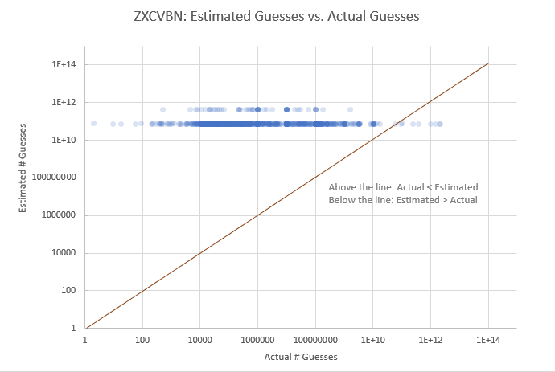

# Homework 4

### Brendan Byers
### CS 478 HW4

For each problem, I kept the parameters used as similar as possible to better compare them to each other.
Most of the commands were ran with the following parameters:

* `-a #` - attack mode
* `-m ###` - hash type
* `--potfile-disable` - stops potfile from being saved
* `--runtime=1200` - limits runtime to 600 seconds (10 minutes)
* `-O` - uses optimized kernel code

The most important parameter was `--potfile-disable`.
It made sure that each time hashcat was run, it wouldn't save the passwords it cracked.
If it did, then each test run would build off the previous runs.
With it disabled, each run is from scratch.

I limited most runs to 20 minutes.
Even when hashcat runs out of time, it still gives a good picture of the performance of a given attack mode.
For those that hit the time limit, the tables also include the time hashcat estimated it would take to finish.
The first few in problem 1 were limited to 10 minutes, but they finished before the time limit so I didn't redo them.

For the attack modes that required a password list I used `rockyou.txt` and `xato-net-10-million-passwords.txt`.
The first was created by a compilation of old password dumps.
The other is a password file created by the company Xato, who compiled the top 10 million passwords and stuck them in this file.

For the brute force attack modes, I used the `?a` character set.
This includes upper and lower case letters, numbers,  and all special characters.
The brute force modes lagged behind the other's in terms of number of passwords cracked.
It may have been due to the large character set used.
They may have performed better if no special characters were used.

I used hashcat version 5.1.0 on windows through powershell.
For each of these problems I used hashcat running on an computer with a i5-4670k @ 3.40GHz processor and a GTX 1070ti graphics card.

## Problem 1

For this problem I targeted the hashes in `unsaltedSHA256.txt`.
They went very quick because they were unsalted, allowing hashcat to try and crack them all at the same time.
The wordlist with rules was most successful.
The 6 character brute force was able to finish in the allotted time, but didn't find a lot.
The 7 and 8 character would have taken 7 hours and 30 days.

|Attack mode|Status|Runtime|Estimated Runtime|# recovered|Speed|Command|
|---|---|---|---|---|---|---|
|Wordlist|Exhausted|7 secs|-|3985/10000 (39.85%)|2213.6 kH/s (2.03ms)|.\hashcat64.exe -a 0 -m 1400 --potfile-disable --runtime=600 -O ..\unsaltedSHA256.txt ..\lists\rockyou.txt|
|Wordlist with rules|Exhausted|4 mins, 2 secs|-|8527/10000 (85.27%)|1881.4 MH/s (5.29ms)|.\hashcat64.exe -a 0 -m 1400 --potfile-disable --runtime=600 -O ..\unsaltedSHA256.txt ..\lists\rockyou.txt -r .\rules\rockyou-30000.rule|
|6 Character Brute Force|Exhausted|5 mins, 7 secs|-|1969/10000 (19.69%)|2452.1 MH/s (3.15ms)|.\hashcat64.exe -a 3 -m 1200 --potfile-disable --runtime=600 -O ..\unsaltedSHA256.txt ?a?a?a?a?a?a|
|7 Character Brute Force|Aborted (Runtime)|20 mins, 0 secs|7 hours, 25 mins|958/10000 (9.58%)|2501.5 MH/s (7.59ms)|.\hashcat64.exe -a 3 -m 1200 --potfile-disable --runtime=1200 -O ..\unsaltedSHA256.txt ?a?a?a?a?a?a?a|
|8 Character Brute Force|Aborted (Runtime)|20 mins, 0 secs|30 days, 16 hours|248/10000 (2.48%)|2500.8 MH/s (7.94ms)|.\hashcat64.exe -a 3 -m 1400 --potfile-disable --runtime=1200 -O ..\unsaltedSHA256.txt ?a?a?a?a?a?a?a?a|
|Combinator|Aborted (Runtime)|20 mins, 0 secs|10 hours, 46 mins|4923/10000 (49.23%)|1863.6 MH/s (10.35ms)|.\hashcat64.exe -a 1 -m 1200 --potfile-disable --runtime=1200 ..\unsaltedSHA256.txt ..\lists\rockyou.txt ..\lists\xato-net-10-million-passwords.txt|

## Problem 2

For this problem i did the exact same thing as in problem one, only replacing the hash file with `saltedSHA256.txt`.
Though the hash rate was similar compared to problem 1, the salts made the hashes much more difficult to crack.
Instead of being able to test a calculated hash against all hashes at once, the salt forces hashcat to do them one at a time.
In the previous problem, wordlist with rules was able to crack 85.27% of the hashes.
In this problem, it did much worse, only cracking1.47% of the passwords.
The wordlist mode did just as well as it did in the previous round, because for each hash it only needed to compare each item on the list.
The wordlist with rules uses each item on the list multiple times with different rules applied, making it much slower.

|Attack mode|Status|Runtime|Estimated Runtime|# recovered|Speed|Command|
|---|---|---|---|---|---|---|
|Wordlist|Exhausted|1 min, 33 secs|-|3987/10000 (39.87%)|1114.0 MH/s (1.02ms)|.\hashcat64.exe -a 0 -m 1420 --potfile-disable --runtime=1200 -O ..\saltedSHA256.txt ..\lists\rockyou.txt|
|Wordlist with rules|Aborted (Runtime)|20 mins, 0 secs|26 days, 15 hours|147/10000 (1.47%)|1840.9 MH/s (9.37ms)|.\hashcat64.exe -a 0 -m 1420 --potfile-disable --runtime=1200 -O ..\saltedSHA256.txt ..\lists\rockyou.txt -r .\rules\rockyou-30000.rule|
|6 Character Brute Force|Aborted (Runtime)|20 mins, 0 secs|36 days, 18 hours|12/10000 (0.12%)|2310.3 MH/s (8.46ms)|.\hashcat64.exe -a 3 -m 1420 --potfile-disable --runtime=1200 -O ..\saltedSHA256.txt ?a?a?a?a?a?a|
|7 Character Brute Force|Aborted (Runtime)|20 mins, 0 secs|9 years, 191 days|0/10000 (0.00%)|2323.6 MH/s (8.42ms)|.\hashcat64.exe -a 3 -m 1420 --potfile-disable --runtime=1200 -O ..\saltedSHA256.txt ?a?a?a?a?a?a?a|
|8 Character Brute Force|Aborted (Runtime)|20 mins, 0 secs|151 years, 18 days|0/10000 (0.00%)|2308.0 MH/s (8.62ms)|.\hashcat64.exe -a 3 -m 1420 --potfile-disable --runtime=1200 -O ..\saltedSHA256.txt ?a?a?a?a?a?a?a?a|
|Combinator|Aborted (Runtime)|20 mins, 0 secs|11 years, 187 days|3/10000 (0.03%)|2047.9 MH/s (9.50ms)|.\hashcat64.exe -a 1 -m 1400 --potfile-disable --runtime=1200 ..\saltedSHA256.txt ..\lists\rockyou.txt ..\lists\xato-net-10-million-passwords.txt|

## Problem 3

In this problem I attempted to crack passwords hashed using scrypt and stored in `scrypt.txt`.
Because of how scrypt is designed to use memory in the hashing process, the hash rate was much slower.
Each hash needs to be cracked individually because of the salt and it takes 1024 iterations to finally produce the hash.
All of the different attack modes had very similar times per hash.
The only mode able to crack any passwords was the wordlist, but it didn't even finish.
It had another estimated 212 days until it would be complete.
All the other ran out of time and were estimated to take more than 10 years.
This shows how effective scrypt is as a hashing method compared to the previsou problems.

|Attack mode|Status|Runtime|Estimated Runtime|# recovered (%)|Hash/Second (Time/Hash)|Command|
|---|---|---|---|---|---|---|
|Wordlist|Aborted (Runtime)|20 mins, 0 secs|212 days, 5 hours|23/10000 (0.23%)|7804 H/s (622.19ms)|.\hashcat64.exe -a 0 -m 8900 --potfile-disable --runtime=1200 -O ..\scrypt.txt ..\lists\rockyou.txt|
|Wordlist with rules|Aborted (Runtime)|20 mins, 1 sec|> 10 years|0/10000 (0.00%)|7809 H/s (621.92ms)|.\hashcat64.exe -a 0 -m 8900 --potfile-disable --runtime=1200 -O ..\scrypt.txt ..\lists\rockyou.txt -r .\rules\rockyou-30000.rule|
|6 Character Brute Force|Aborted (Runtime)|20 mins, 0 secs|> 10 years|0/10000 (0.00%)|7835 H/s (619.63ms)|.\hashcat64.exe -a 3 -m 8900 --potfile-disable --runtime=1200 -O ..\scrypt.txt ?a?a?a?a?a?a|
|7 Character Brute Force|Aborted (Runtime)|20 mins, 0 secs|> 10 years|0/10000 (0.00%)|7815 H/s (621.15ms)|.\hashcat64.exe -a 3 -m 8900 --potfile-disable --runtime=1200 -O ..\scrypt.txt ?a?a?a?a?a?a?a|
|8 Character Brute Force|Aborted (Runtime)|20 mins, 0 secs|> 10 years|0/10000 (0.00%)|7673 H/s (634.20ms)|.\hashcat64.exe -a 3 -m 8900 --potfile-disable --runtime=1200 -O ..\scrypt.txt ?a?a?a?a?a?a?a?a|
|Combinator|Aborted (Runtime)|20 mins, 1 sec|> 10 years|0/10000 (0.00%)|7811 H/s (619.06ms)|.\hashcat64.exe -a 1 -m 8900 --potfile-disable --runtime=1200 -O ..\scrypt.txt ..\lists\rockyou.txt ..\lists\xato-net-10-million-passwords.txt|

## Problem 4

For this problem, I used the `myspace.txt` file to get passwords.
I sampled 100 using `shuf -n 1000 myspace.txt > myspace_subset.txt`, which pulls 100 random lines from the file.
Next, I wrote a small script in python that goes through each line of the `myspace_subset.txt` file and uses the zxcvbn library to calculate the estimated number of guesses to crack it.
It is the file labeled `passCheck.py`.
The script generated a file named `myspace_results.csv`.
I then used Hashcat to crack the passwords and get the number of guesses needed to crack it.
I decided to use a wordlist with rules with the command `.\hashcat64.exe -a 0 -m 99999 --potfile-disable --runtime=1200 -O --outfile-format 10  ..\myspace_subset.txt ..\lists\rockyou.txt -r .\rules\rockyou-30000.rule`.
The `--outfile-format 10` prints out the password and the number of guesses needed to crack it.
Out of 1000 passwords sampled, hashcat was able to crack 978/1000 (97.8%).
The results are in `myspace_results.xlsx`.

The results were used to generate this chart:

Each password that was cracked was plotted as a faint dot.
If the dot was to the left of the line, it means that the actual number of guesses was less than the number estimated be zxcvbn.
If they are to the right, then it took more guesses than estimated.

This graph shows that the tool primarily underestimated the number of guesses needed to crack the password.
I think it does of poor job of estimating password strength, at least when compared to the attack mode used.
It also seems to group it's estimates into two areas, between 1E+10 and 1E+12.
It shows how inaccurate the algorithm may be, as the actual number of guesses varied quite a lot.